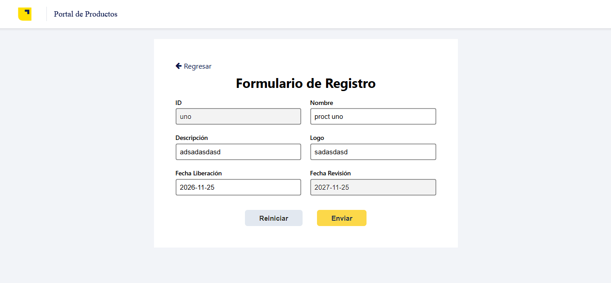
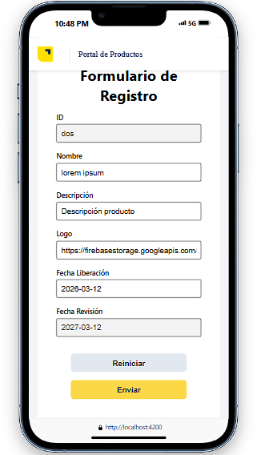

# NttdataTest

<div style="display:flex">

</div>

In this repository you will find a technical test provided by nttData

## Web





## Responsive




## Built With

- Angular 19
- Css
- Typescript
- Git
- Jest

## Getting Started

**In this repository I am going to create a page that contains an exercise developed for nttData.**

## Run it 🔨

Use the following steps to run this web locally:

- install nodeJs

- open the terminal

- run the necessary back-end service, make sure to disable cors

- get in the directory you want this folder to appear

- put: git clone `git@github.com:Adrian-Bastidas/nttdataTest.git`

- open the folder with a new terminal (This can be done with a code editor or directly in the terminal.)
- put "ng serve"

```bash
ng serve
```

## Running unit tests 🔨

```bash
npm jest
```

## Author

👤 **Adrian Rafael Bastidas Moya**

- GitHub: [@Adrian-Bastidas](https://github.com/Adrian-Bastidas)
- Facebook: [Adrian Bastidas](https://www.facebook.com/rafdrian/)
- LinkedIn: [Adrian Rafael Bastidas Moya](https://www.linkedin.com/in/adrian-rafael-bastidas-moya-5b940419b/)
